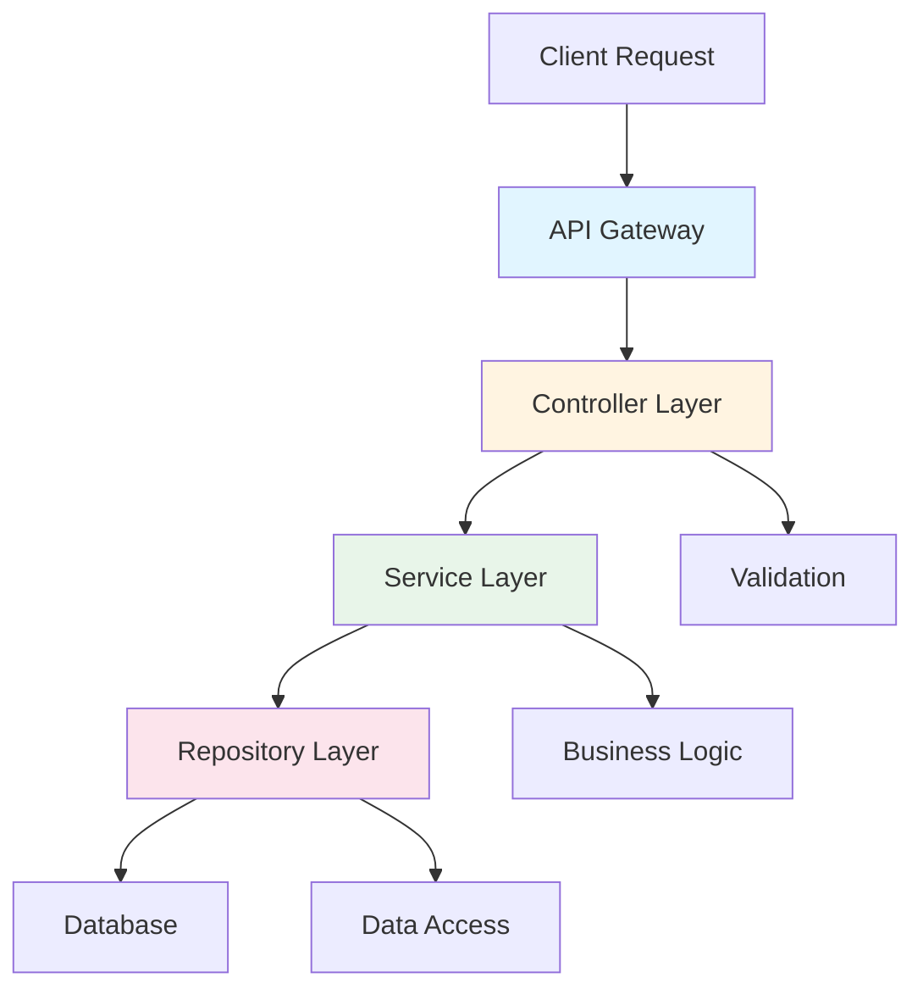

# ADR-002: API Architecture Pattern

## Status
Accepted

## Context
We need to establish a consistent pattern for our API endpoints to ensure maintainability and scalability as the system grows.

## Decision
We will adopt a layered architecture with clear separation of concerns:

## Consequences

### Positive
- Clear separation of concerns
- Easier to test each layer independently
- Better maintainability

### Negative
- More boilerplate code
- Learning curve for new developers

## Implementation Notes
Each layer has specific responsibilities that should not be mixed with other layers.
