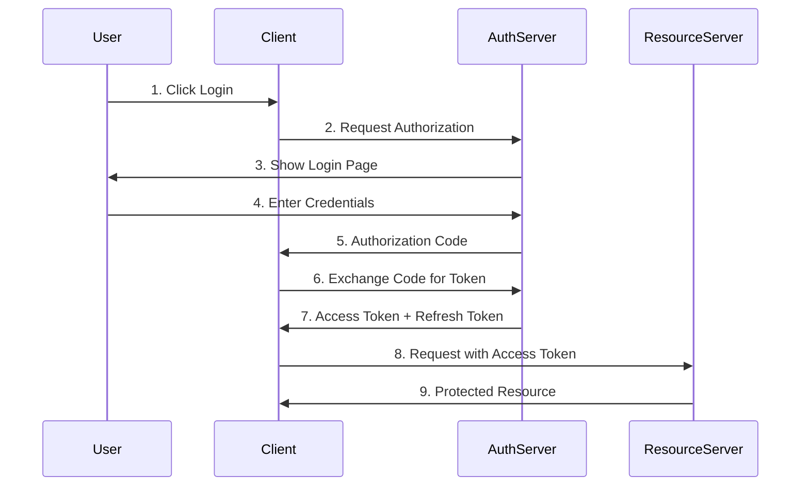

# ADR-003: OAuth2 Authentication Flow

## Status
Accepted

## Context
We need a secure authentication mechanism that supports both web and mobile clients.

## Decision
Implement OAuth2 with JWT tokens using the authorization code flow.

## Consequences

### Positive
- Industry standard approach
- Supports multiple client types
- Secure token-based authentication
- Refresh token support for long sessions

### Negative
- More complex than basic auth
- Requires token storage management
- Need to handle token refresh logic

## Security Considerations
- Tokens stored in httpOnly cookies
- Refresh tokens rotated on use
- Short-lived access tokens (15 minutes)
