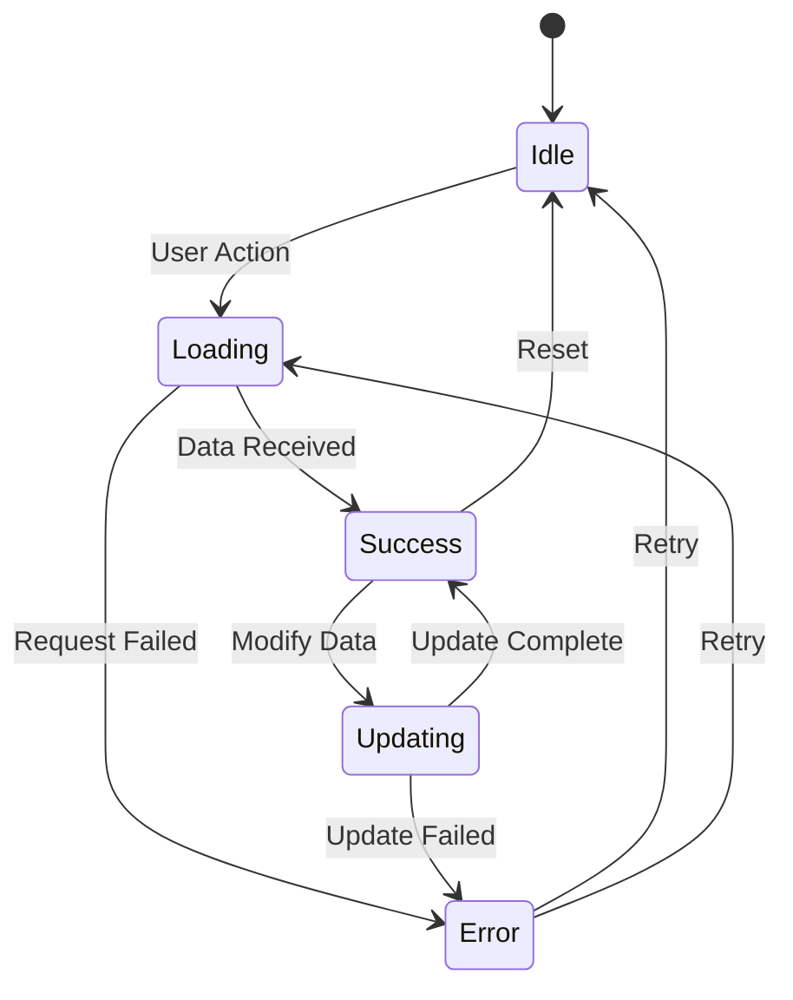

# ADR-004: Frontend State Management

## Status
Accepted

## Context
Our React application is growing in complexity and we need a consistent approach to managing state across components.

## Decision
Use a combination of React hooks and URL state for different types of state.

## State Categories

| State Type | Solution | Example |
|------------|----------|---------|
| URL State | useUrlState hook | Selected model, view mode |
| Component State | useState | Form inputs, toggles |
| Shared State | Context + hooks | User preferences |
| Server State | WebSocket | Live file updates |

## Consequences

### Positive
- Simple and predictable
- No external dependencies
- URL-based state enables deep linking
- Easy to debug

### Negative
- Manual synchronization needed
- No time-travel debugging
- Not suitable for very complex state trees
