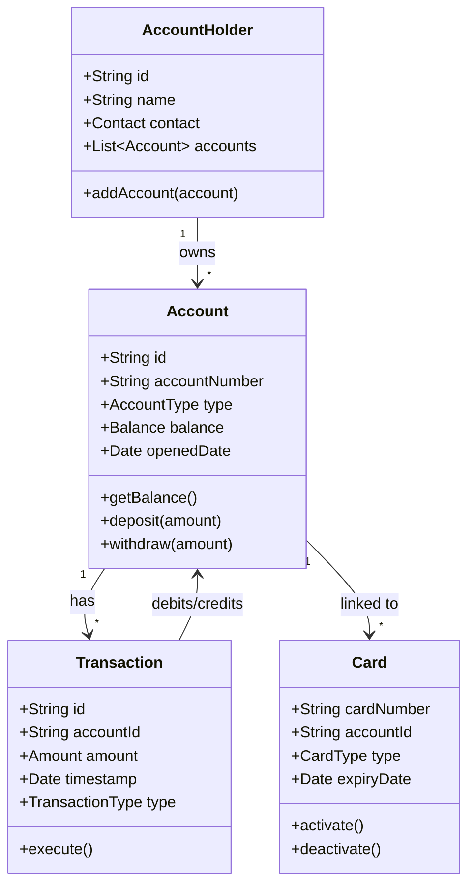
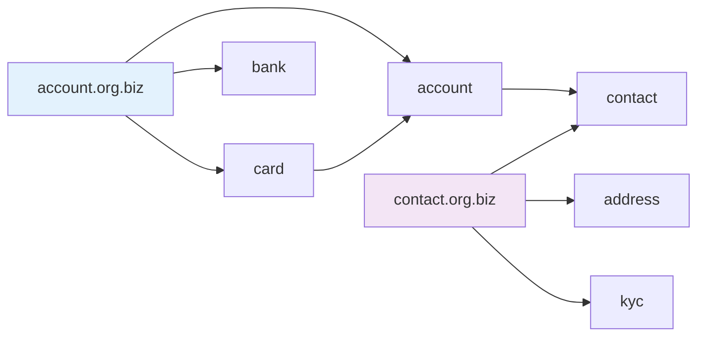

# ADR-005: Domain Data Model Structure

## Status
Proposed

## Context
We need to standardize how we structure our JSON Schema files and the relationships between different domain entities.

## Decision
Adopt a hierarchical domain-based structure with explicit relationship modeling.

## Schema Organization

## Consequences

### Positive
- Clear domain boundaries
- Explicit relationships
- Easier to understand data flow
- Better code organization

### Negative
- More files to manage
- Need tooling to visualize relationships
- Potential for circular dependencies

## Migration Path
1. Create new domain directories
2. Move existing schemas
3. Add relationship metadata
4. Update graph builder
