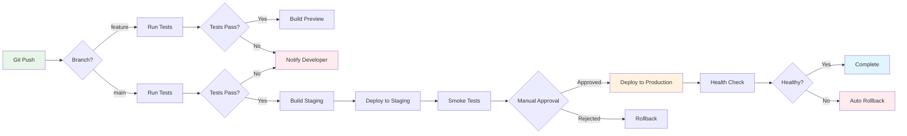

# ADR-006: CI/CD Deployment Pipeline

## Status
Accepted

## Context
We need an automated deployment pipeline that ensures code quality and safe deployments to production.

## Decision
Implement a multi-stage pipeline with automated testing and manual approval gates.

## Pipeline Stages

1. **Validation**: Lint, type check, unit tests
2. **Build**: Create production bundle
3. **Staging Deploy**: Deploy to staging environment
4. **Integration Tests**: Run full test suite
5. **Manual Gate**: QA approval required
6. **Production Deploy**: Blue-green deployment
7. **Monitoring**: Health checks and metrics

## Consequences

### Positive
- Automated quality checks
- Safe deployments with rollback capability
- Clear deployment process
- Audit trail for all deployments

### Negative
- Longer deployment time
- Requires infrastructure setup
- Manual approval can create bottlenecks

## Rollback Strategy
- Keep last 3 versions deployed
- Instant rollback via load balancer switch
- Database migrations must be backwards compatible
