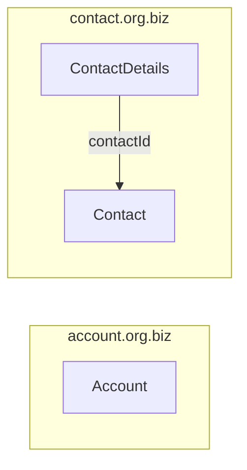

# Schema Relationship Diagram

```mermaid
flowchart LR
  subgraph account_org_biz [account.org.biz]
    account_org_biz_account["Account"]
  end

  subgraph contact_org_biz [contact.org.biz]
    contact_org_biz_contact["Contact"]
    contact_org_biz_contact_details["ContactDetails"]
  end

  contact_org_biz_contact_details -->|contactId| contact_org_biz_contact
```