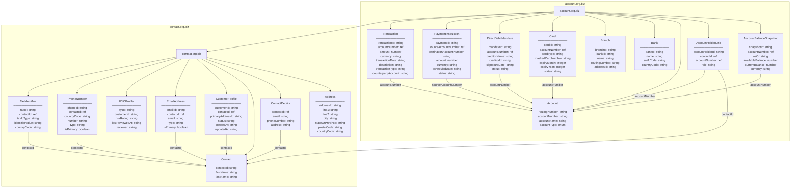

# Schema Relationship Diagram

```mermaid
flowchart TB

  subgraph account_org_biz [account.org.biz]
    account_org_biz_anchor["account.org.biz"]
    account_org_biz_account_balance_snapshot["AccountBalanceSnapshot<br/>──────────────<br/>snapshotId: string<br/>accountNumber: ref<br/>asOf: string<br/>availableBalance: number<br/>currentBalance: number<br/>currency: string"]
    account_org_biz_anchor --> account_org_biz_account_balance_snapshot
    account_org_biz_account_holder_link["AccountHolderLink<br/>──────────────<br/>accountHolderId: string<br/>contactId: ref<br/>accountNumber: ref<br/>role: string"]
    account_org_biz_anchor --> account_org_biz_account_holder_link
    account_org_biz_account["Account<br/>──────────────<br/>routingNumber: string<br/>accountNumber: string<br/>accountName: string<br/>accountType: enum"]
    account_org_biz_anchor --> account_org_biz_account
    account_org_biz_bank["Bank<br/>──────────────<br/>bankId: string<br/>name: string<br/>swiftCode: string<br/>countryCode: string"]
    account_org_biz_anchor --> account_org_biz_bank
    account_org_biz_branch["Branch<br/>──────────────<br/>branchId: string<br/>bankId: string<br/>name: string<br/>routingNumber: string<br/>addressId: string"]
    account_org_biz_anchor --> account_org_biz_branch
    account_org_biz_card["Card<br/>──────────────<br/>cardId: string<br/>accountNumber: ref<br/>cardType: string<br/>maskedCardNumber: string<br/>expiryMonth: integer<br/>expiryYear: integer<br/>status: string"]
    account_org_biz_anchor --> account_org_biz_card
    account_org_biz_direct_debit_mandate["DirectDebitMandate<br/>──────────────<br/>mandateId: string<br/>accountNumber: ref<br/>creditorName: string<br/>creditorId: string<br/>signatureDate: string<br/>status: string"]
    account_org_biz_anchor --> account_org_biz_direct_debit_mandate
    account_org_biz_payment_instruction["PaymentInstruction<br/>──────────────<br/>paymentId: string<br/>sourceAccountNumber: ref<br/>destinationAccountNumber: string<br/>amount: number<br/>currency: string<br/>scheduledDate: string<br/>status: string"]
    account_org_biz_anchor --> account_org_biz_payment_instruction
    account_org_biz_transaction["Transaction<br/>──────────────<br/>transactionId: string<br/>accountNumber: ref<br/>amount: number<br/>currency: string<br/>transactionDate: string<br/>description: string<br/>transactionType: string<br/>counterpartyAccount: string"]
    account_org_biz_anchor --> account_org_biz_transaction
  end

  subgraph contact_org_biz [contact.org.biz]
    contact_org_biz_anchor["contact.org.biz"]
    contact_org_biz_address["Address<br/>──────────────<br/>addressId: string<br/>line1: string<br/>line2: string<br/>city: string<br/>stateOrProvince: string<br/>postalCode: string<br/>countryCode: string"]
    contact_org_biz_anchor --> contact_org_biz_address
    contact_org_biz_contact_details["ContactDetails<br/>──────────────<br/>contactId: ref<br/>email: string<br/>phoneNumber: string<br/>address: string"]
    contact_org_biz_anchor --> contact_org_biz_contact_details
    contact_org_biz_contact["Contact<br/>──────────────<br/>contactId: string<br/>firstName: string<br/>lastName: string"]
    contact_org_biz_anchor --> contact_org_biz_contact
    contact_org_biz_customer_profile["CustomerProfile<br/>──────────────<br/>customerId: string<br/>contactId: ref<br/>primaryAddressId: string<br/>status: string<br/>createdAt: string<br/>updatedAt: string"]
    contact_org_biz_anchor --> contact_org_biz_customer_profile
    contact_org_biz_email_address["EmailAddress<br/>──────────────<br/>emailId: string<br/>contactId: ref<br/>email: string<br/>type: string<br/>isPrimary: boolean"]
    contact_org_biz_anchor --> contact_org_biz_email_address
    contact_org_biz_kyc_profile["KYCProfile<br/>──────────────<br/>kycId: string<br/>customerId: string<br/>riskRating: string<br/>lastReviewedAt: string<br/>reviewer: string"]
    contact_org_biz_anchor --> contact_org_biz_kyc_profile
    contact_org_biz_phone_number["PhoneNumber<br/>──────────────<br/>phoneId: string<br/>contactId: ref<br/>countryCode: string<br/>number: string<br/>type: string<br/>isPrimary: boolean"]
    contact_org_biz_anchor --> contact_org_biz_phone_number
    contact_org_biz_tax_identifier["TaxIdentifier<br/>──────────────<br/>taxId: string<br/>contactId: ref<br/>taxIdType: string<br/>identifierValue: string<br/>countryCode: string"]
    contact_org_biz_anchor --> contact_org_biz_tax_identifier
  end

  %% Layout chain to stack domains vertically
  account_org_biz_anchor --> contact_org_biz_anchor

  %% Relationships (foreign keys via $ref)
  account_org_biz_account_balance_snapshot -->|accountNumber| account_org_biz_account
  account_org_biz_account_holder_link -->|contactId| contact_org_biz_contact
  account_org_biz_account_holder_link -->|accountNumber| account_org_biz_account
  account_org_biz_card -->|accountNumber| account_org_biz_account
  account_org_biz_direct_debit_mandate -->|accountNumber| account_org_biz_account
  account_org_biz_payment_instruction -->|sourceAccountNumber| account_org_biz_account
  account_org_biz_transaction -->|accountNumber| account_org_biz_account
  contact_org_biz_contact_details -->|contactId| contact_org_biz_contact
  contact_org_biz_customer_profile -->|contactId| contact_org_biz_contact
  contact_org_biz_email_address -->|contactId| contact_org_biz_contact
  contact_org_biz_phone_number -->|contactId| contact_org_biz_contact
  contact_org_biz_tax_identifier -->|contactId| contact_org_biz_contact
```